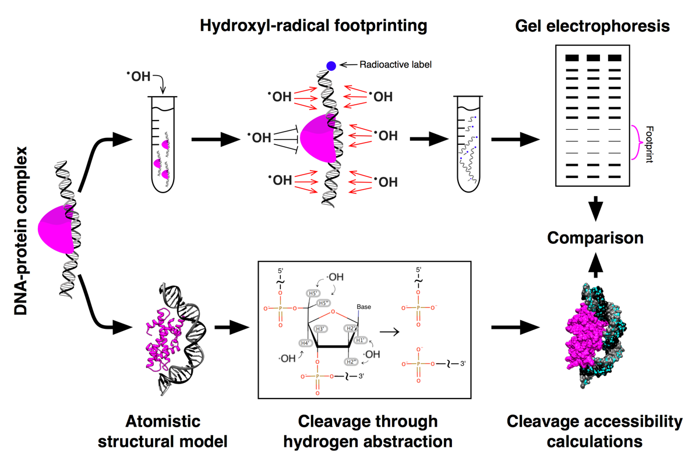

# HYDROID
HYDROID (HYDroxyl-Radical fOotprinting Interpretation for DNA) is a python package for the analysis of the experimental data generated by hydroxyl-radical [footprinting](https://en.wikipedia.org/wiki/DNA_footprinting) (HRF) of DNA-protein complexes and its interpretation through comparison to theoretical predictions from molecular models.



## Documentation
[For detailed documentation - click here](docs/INDEX.md)

Video tutorial is [available here](https://www.youtube.com/playlist?list=PL_GHGdsPyn0nVSvrRnyvuvkRCrNBjqeuC).

## Quick-start guide

### Quick installation
Install Miniconda with Python2.7 for your platform from [https://conda.io/miniconda.html](https://conda.io/miniconda.html).

```
conda install -c hydroid hydroid
```

Test HYDROID:

```
HYDROID_test_exp
HYDROID_test_pred
```


For alternative installation instructions for Linux, MacOS and PC see [INSTALL.md](docs/INSTALL.md).

### Start by downloading and modifying an example

```
HYDOIRD_get_example1
cd example1
python exp_s2_assign_peaks.py
...
```

See full example set and instructions in [examples](examples/README.md)

## Citing HYDROID
Please cite HYDROID using following publications:
- A.K. Shaytan et al. (in preparation)


