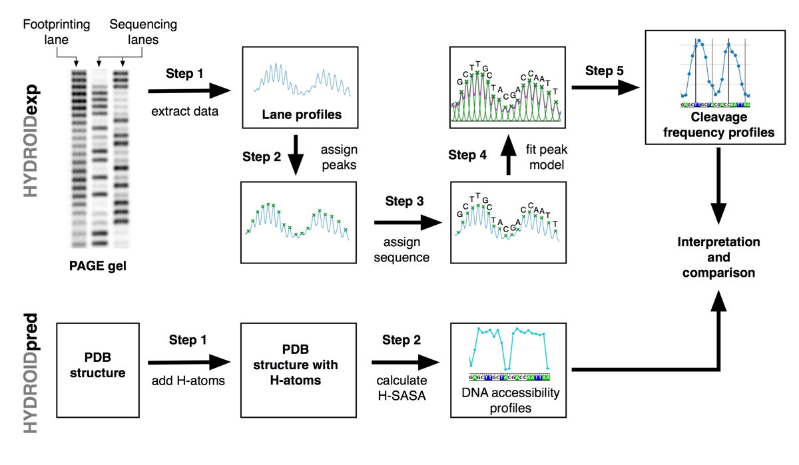

# HYDROID: User guide

## Introduction
HYDROID (HYDroxyl-Radical fOotprinting Interpretation for DNA) is a python package for the analysis of the experimental data generated by hydroxyl-radical footprinting (HRF) of DNA-protein complexes and its interpretation through comparison to theoretical predictions from molecular models.

The overall idea is outlined in the figure below.

For more information see [Theoretical backgroud of hydroxyl-radical footprinting](#theoretical-backgroud-of-hydroxyl-radical footprinting) section.

## Workflow

This package has two Python modules implementing complementary functionalities:
* [HYDROIDexp](../hydroid/HYDROIDexp.py) - extraction of DNA cleavage frequency profiles from gel electrophoresis images.
* [HYDROIDpred](../hydroid/HYDROIDpred.py) - estimation of theoretical DNA cleavage frequency profiles from PDB structures through estimating deoxyribose hydrogen atoms solvent accessibility (H-SASA).

## Documentation

Several step-by-step examples serve as a manual to the package.
* [Example 1](../examples/example1): Quantifying HRF of a centromeric nucleosome with DNA radioactively labeled at 3' end. Predicting cleavage frequency profiles from an atomistic structure model and comparing to experimental ones.
* [Example 2](../examples/example2): Quantifying HRF of a nucleosome with DNA radioactively labeled at 5' end. Highlights conversion of gel images to data profiles via ImageJ.

Video tutorial is available [here](https://www.youtube.com/playlist?list=PL_GHGdsPyn0nVSvrRnyvuvkRCrNBjqeuC).

DocString documentation for every function is provided inside the libraries and step-by-step example python files.

Detailed information about HYDROID algorithms can be found in the accompanying publication: A.K. Shaytan et al. (in preparation)

## Installation

[INSTALL.md](INSTALL.md) provides common installation examples for Linux, MacOS and PC.

## Citing HYDROID
Please cite HYDROID using following publication:
- A.K. Shaytan et al. (in preparation)

## Theoretical backgroud of hydroxyl-radical footprinting

Hydroxyl-radical footprinting is one of [DNA footprinting methods](https://en.wikipedia.org/wiki/DNA_footprinting).

For the initial familiarization with hydroxyl-radical footprinting techniques and theory following references and references therein are suggested:

* Jain, S.S. and Tullius, T.D. (2008) [Footprinting protein-DNA complexes using the hydroxyl radical. Nature protocols, 3, 1092-1100.](http://www.nature.com/nprot/journal/v3/n6/full/nprot.2008.72.html)

